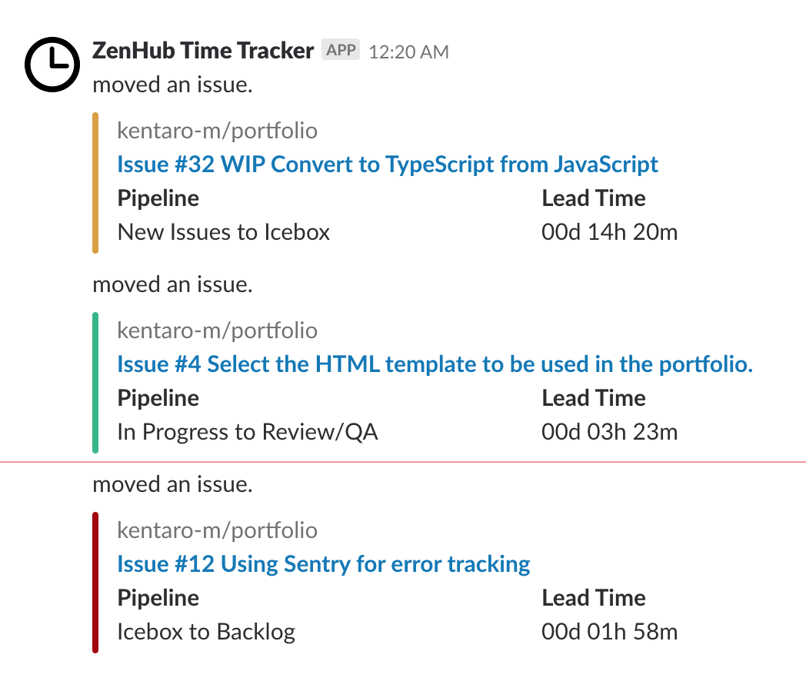

# :watch: ZenHub Time Tracker
:construction_worker: Keep track of time to move an issue between pipelines and notify the time into Slack.



## :arrow_forward: Usage
Notify recent activity on ZenHub into Slack channel when an issue move between pipelines. Activity includes issue title, transfer pipeline and time of transfer pipeline. 

## :floppy_disk: Installation

### Create an incoming webhooks
Please refer to [this page](https://api.slack.com/incoming-webhooks) and set it up. Make a note of the created Webhook URL.

### Genarate a ZenHub API token
Generate token for calling ZenHub API on [ZenHub's dashboard](https://app.zenhub.com/dashboard/tokens). Make a note of the generated token.

### Install dependencies
```bash
$ npm install
```

### Update the configuration file
Update the configuration file (`config/default.json`).

```
{
  "github": {
    "host": "githubenterprise.example.com" // Optional: need to set GitHub host if you use GitHub Enterprise (default: empty).
  },
  "zenhub": {
    "host": "zenhubenterprise.example.com", // Optional: need to set ZenHub host if you use ZenHub Enterprise (default: empty).
    "repoId": "" // Required: the ID of the repository (e.g. kentaro-m/zenhub-time-tracker repository is 156997033).
  },
  "slack": {
    "message": {
      "text": "moved an issue.", // Optional: the message when an issue move between pipelines.
      "color": { // the color of Slack messages change by the time it takes to move an issue between pipelines.
        "unit": "Hours", // Required: select only one from [Years|Months|Days|Weeks|Hours|Minutes|Seconds].
        "threshold": {
          "danger": 24, // Reqired: add value as an integer.
          "warn": 12 // Required: add value as an integer.
        }
      }
    }
  }
}
```

### Create the deployment package
Create the Amazon S3 bucket to upload the deployment package.
```bash
$ aws s3 mb s3://<bucket-name> --region <region-name>
```

Create the deployment package using `sam` command.

NOTE: You can use `aws cloudformation` command instead of `sam` command.
```bash
$ sam package \
     --template-file template.yml \
     --output-template-file serverless-output.yml \
     --s3-bucket <s3-bucket-name>
```

### Deploy
Deploy the application using `sam` command.

After the deployment is complete, move to the CloudFormation console and check the value of the `RequestURL` in the output section.

NOTE: You can use `aws cloudformation` command instead of `sam` command.
```bash
$ sam deploy \
   --template-file serverless-output.yml \
   --stack-name <new-stack-name> \
   --parameter-overrides ZenHubToken=<token> SlackWebhookUrl=<url> \ 
   --capabilities CAPABILITY_IAM
```

Please add the value of `Request URL` on ZenHub's integrations page.

* Integrations section
    * **Select the service**  Custom
    * **Choose a Repository to connect**  Your repository
    * **Webhook URL**  the value of `Request URL`

## :memo: License
MIT